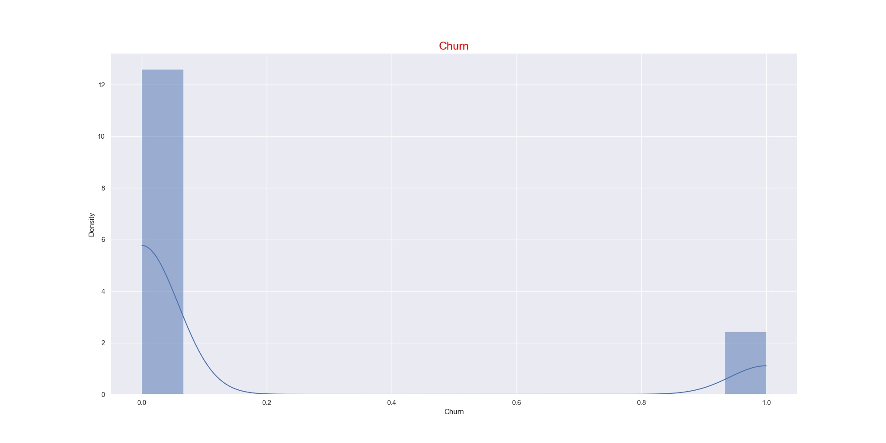

# Predict-Customer-Churn
Project 1 of Machine Learning DevOps Engineer Nanodegree by Udacity. [Link](https://www.udacity.com/course/machine-learning-dev-ops-engineer-nanodegree--nd0821)

## Project Description
In this project, you will implement your learnings to identify credit card customers that are most likely to churn. The completed project will include a Python package for a machine learning project that follows coding (PEP8) and engineering best practices for implementing software (modular, documented, and tested). The package will also have the flexibility of being run interactively or from the command-line interface (CLI).

This project will give you practice using your skills for testing, logging, and best coding practices from this lesson. It will also introduce you to a problem data scientists across companies face all the time. How do we identify (and later intervene with) customers who are likely to churn?

## Results overview

## Running Files
navigate to **churn_tests.py** and run python churn_tests.py. The test cases read .csv file from data, run all implemented functions and store results to images folder. trained models are saved to models folder  

## Dependencies

