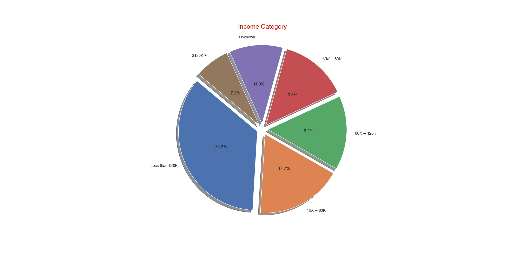
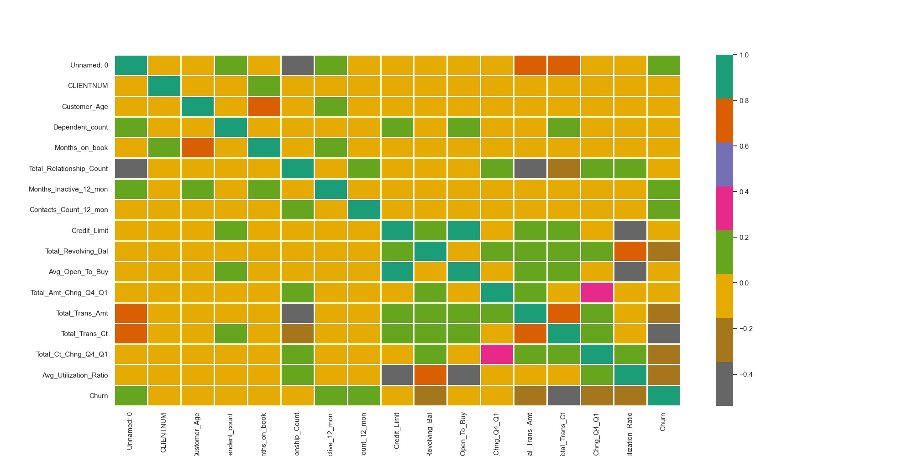
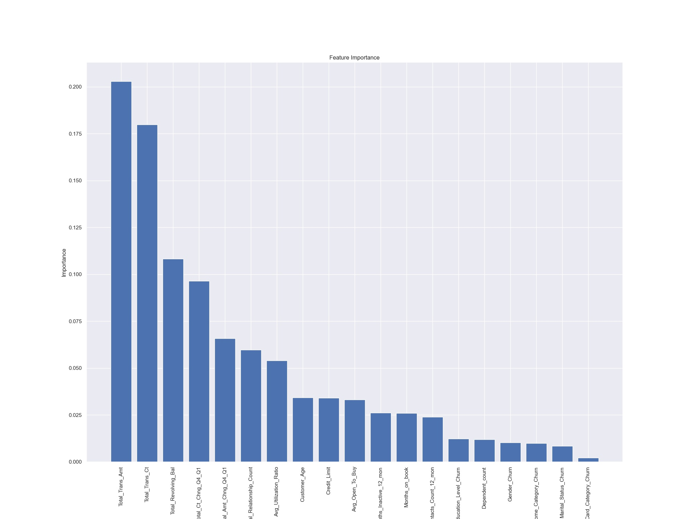
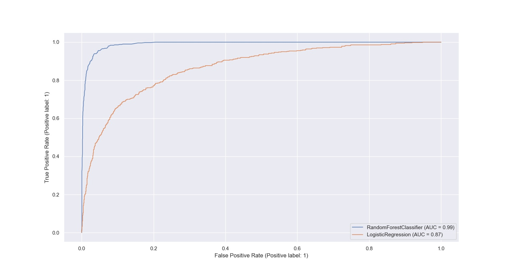

# Predict-Customer-Churn
Project 1 of Machine Learning DevOps Engineer Nanodegree by Udacity. [Link](https://www.udacity.com/course/machine-learning-dev-ops-engineer-nanodegree--nd0821)

## Project Description
identify credit card customers that are most likely to churn. The implementation follows coding (PEP8) and engineering best practices for implementing software (modular, documented, and tested). 

To use this package, navigate to **churn_tests.py** and run python churn_tests.py. The program read .csv file from data, run all implemented functions and store results to images folder. Trained models are saved to models folder. List of all logs are automatically generated and located in churn_library.log in folder logs.

Training data was obtained pulled from [Kaggle](https://www.kaggle.com/sakshigoyal7/credit-card-customers/code)

## Results overview

Without loss of generality, the following figures show how churn is related to the income category. Complete figures of exploratory results can be found under images/eda

Initial feature correlation was invistigated

following that feature importance was analyzed

ROC for two classifiers (Random Forest | Logistic Regression) and the corresponding area under the curve is depicted in the following figure.

